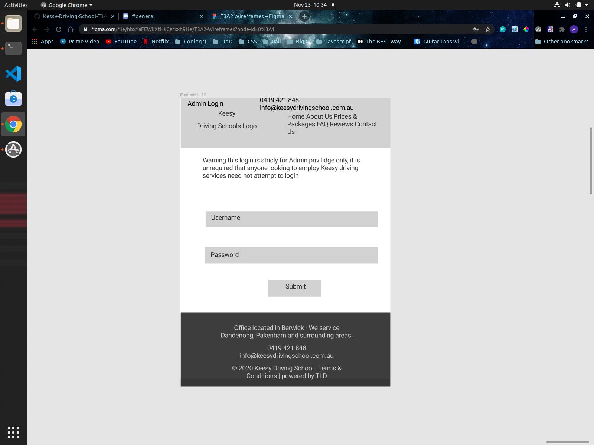

# Keesy Driving School:Full MERN Stack App

#### Developed by: [Anthony Wilde](https://www.linkedin.com/in/anfiiwilde/) | [Syeda Ismat Farjana](https://www.linkedin.com/in/syeda-ismat-farjana/) | Assignment T3A2-A

#### [Link To The Github Repository](https://github.com/Kessy-Driving-School-T3A2/T3A2-A)

---

## Description of our website

Our Website will be a remake of a static website for a Driving School Company called Keesy Driving School using MERN stack technology. Mainly updating certain features to assist the owner of the company to easily interact with his website for the future.

---

## Purpose

The purpose of the website is to increase the amount of business that Keesy Driving Schools will receive by creating another medium for people to find out/ discover Keesy Driving Schools or to compound the idea that the driving school is the right one for you.

---

## Functionality / Features

    
Click here to expand

On top of the default features included with the static website we will include several new features.

### Original Features to be copied over:

- **Home Page**

- **About Me Page**

- **Contact Info**

- **Prices**

- **Locations**

### Additional Features to be added:

- **Login for Admin (Owner's Account)**

- **Ability for owner to modify prices**

- **Clean up images/ make less blurry**

- **Make webpages dynamic**

- **Email filtering for form**

- **Modify zone of influence(area in which Keesy Driving School will operate)**

---

## Target audience

The target audience of the site is and will continue to be teenagers looking to get there P plates or adults both young and old who are looking to get back into driving or never got there P's as a youth. The website is to act as a medium for them to get into touch with Keesy Driving Schools if other forms of advertisement hasn't gotten through to them, or if they saw it in passing and wanted to have a closer look at their own conveniance.

---

## Tech stack

    
Click here to expand

**Frontend:**

- HTML
- CSS
- JS
- React

**Backend**

- Express.js
- Node.js

**Database**

- MongoDB

**Deployment**

- Heroku / Netlify

**Utilities**

- Passport
  -- user authentication

**Tools**

- VS code
  -- as text editor
- Git

- Github

- Trello
  -- tracking development of website

- Figma
  -- create wireframes version 1

- Figma
  -- create wireframes prototype

**Test**

- jest

  

---

## User Stories with Implementation of Agile methodology

    
Click here to expand

**Persona:** Craig / Student / 16/ <strong>User</strong> / Wants to be able to drive to school in Year 12/ wants to avoid phone calls if possible  
**Persona:** <strong>Stephanie</strong>/ Mother / 39.5 / <strong>User</strong> / Wants child to get P's/ To Busy to teach themselves/ Child didnt appreciate her teaching/ Rich  
**Persona:** <strong>Jeff</strong>/ No Licence + Apprentice Tradesmen / 25 / <strong>User</strong> Bullied into driving manual by work colleges/ Camping enthusiast  
**Persona:** <strong>Keesy</strong> / <strong>Business Owner </strong>/ <strong>Admin</strong> / Wants a cool website  

<strong>Craig(User)</strong>: 
I want to see how far the business is willing to travel for work. So I can know if I live close enough.  
I am a poor student, I want to see the cost of employing the driving schools services. So I can decide whether I can afford it. 
I want to find out how I can contact the business, so I can organize an appointment.  
<del>As a millenial I want to contact via email, so I dont have to ring someone on the phone. </del>
As a young person I want to contact via email/ text, so I dont have to ring someone on the phone. 

<strong>Stephanie(User)</strong>: 
I want to find out how I can contact the business, so I can organize an appointment for my child.  
I want to know if I can buy in bulk (lessons), so I can give my child a present. 
I want to see how far the business is willing to travel for work. So I can know if I live close enough.  
<del>As a mother, I want to know ... </del> 

<strong>Jeff(User)</strong>: 
I want to know if I can decide between manual or automatic transmission, I wish to drive manual.  
I want to find out if I can employ this service during non working hours (9am-5pm), so I can continue to work throughout the day. 
I want to find out how I can contact the business, so I can organize an appointment.  
I want to see how far the business is willing to travel for work. So I can know if I live close enough.  

<strong>Keesy(Admin)</strong>: 
I want to be able to change prices on my site, so I can update prices throughout the year/ over many years. 
I want my contact info to be avaliable at all times, so I will receive more business. 
I want the colors on the website to be black and orange. So they match up with the colors of my brand  

---

## Database

## Data Flow Diagram

    
Click here to expand

 

---

## Application Architecture Diagram

    
Click here to expand

 

---

## Wireframes & Prototypes showing Agile methodology Implementation

### Wireframes

    
Click here to expand

| Different pages | Desktop                              | Tablet                               | Mobile Phone                           |
| --------------- | ------------------------------------ | ------------------------------------ | -------------------------------------- |
| Home            |  |  |    |
| About Us        |  |  |    |
| Packages        |  |  |  |
| Contact Us      |    |     |        |
| FAQ             |          |           |              |
| Review          |       |        |           |
| Admin Login     |   |    |       |
| Admin FAQ       |     |      |         |
| Admin Prices    |   |    |       |

### Prototypes

    
Click here to expand

| Different Screens | Prototyped Wireframes                | Link to Prototype                                                                                                    |
| ----------------- | ------------------------------------ | -------------------------------------------------------------------------------------------------------------------- |
| Desktop           |  | [Figma](https://www.figma.com/proto/hbxYaFEWkXtHkCarxxh9He/T3A2-Wireframes?node-id=69%3A57&scaling=scale-down-width) |
| Tablet            |  | [Figma](https://www.figma.com/proto/hbxYaFEWkXtHkCarxxh9He/T3A2-Wireframes?node-id=156%3A1774&scaling=scale-down)    |
| Mobile phone      |  | [Figma](https://www.figma.com/proto/hbxYaFEWkXtHkCarxxh9He/T3A2-Wireframes?node-id=109%3A967&scaling=scale-down)     |

---

## Third party services

    
Click here to expand

### Heroku / Netlify

---

## Planning methodology

    
Click here to expand

[ Link to Trello](https://trello.com/invite/b/hBRx8eK4/b6879d4a3a712979efcad24491cfcf2c/t3a2-a-mern-full-stack-apppart-a)

Screen shots throughout the **Development of Planning**

| Weeks  | Days      | Screen shots                         |
| ------ | --------- | ------------------------------------ |
| Week 1 | Day 1     |  |
|        | Day 2     |  |
|        | Day 3     |  |
| Week 2 | Day 1     |  |
|        | Day 2     |  |
|        | Day 3     |  |
| Week 3 | Day 1 - 3 |  |

---

## Preffered Test Methods

### Automated Test | Jest: Unit Test

    
Click here to expand

- An Opensource Project maintained by **Facebook**

- A **Javascript Library** to

  - Create tests
  - Run tests
  - Structures tests

- An **NPM** package to install

- A Default choice for a **React** Project

**Reason for choosing Jest**

- Jest manages metadata of the source cose so it can run relevent test files by acquiring the knowledge about source code and which part of code has been changed.

- Time saver

### Manual Test | Bug Fixing

    
Click here to expand

**Reason for choosing Manual test**

- Tests from Humans perspective

- Give the scope to explore and hunt down bugs

- No chance of errors

- Give the scope to understand the problem on a conceptual and emotional level

- Connects with end-user

- Introduce a level of empathy

## Possible Challanges Of Planning During Development Process

    
Click here to expand

#### Possible challanges

During the actual implimentation of this planning, we might need to change certain plans which will depend on

- Regular feedback checking regarding the balance between our **Client's need** and **possible outcome** of certain feature plans

- As a Developer team, we will try our best to create the features as promised and deliver it to the customer, still there is a possiblity of having an issue regarding time managemant and implimenting **Client's need** as this project is a **part of our Academic Assessment** and the **time limit** to finish the project is **controlled** by the Academy.

#### Possible solution

- Providing the details information about any featurs implimentaton. **how client want's it to be done** vs **how it will look after being done**, and change the plan if required

- Weekly meeting with our **Client** for through discussion about **what our Client needs** and **what can be done** in the **provided time period**

---

---
